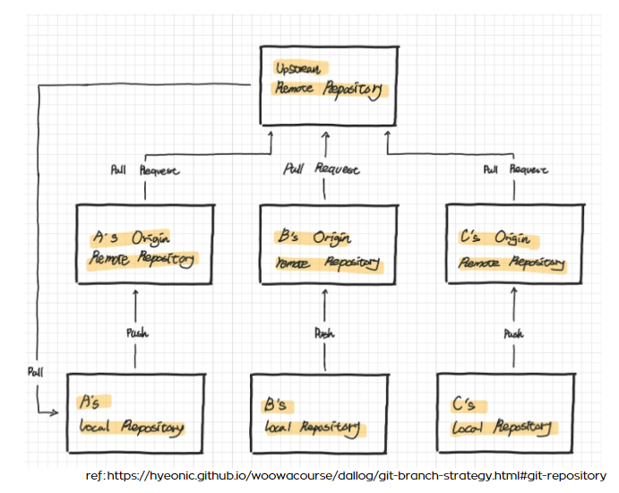
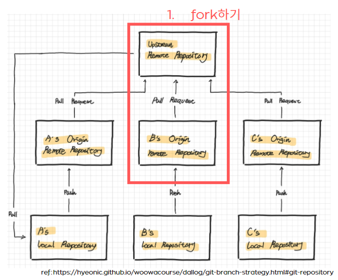
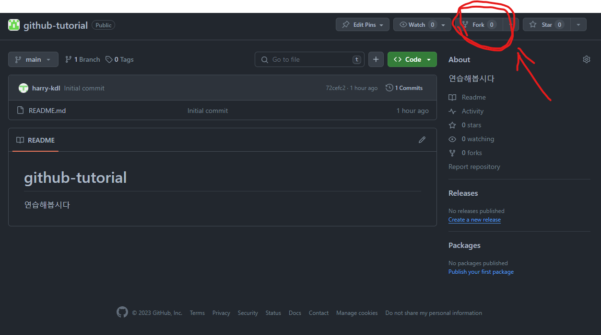
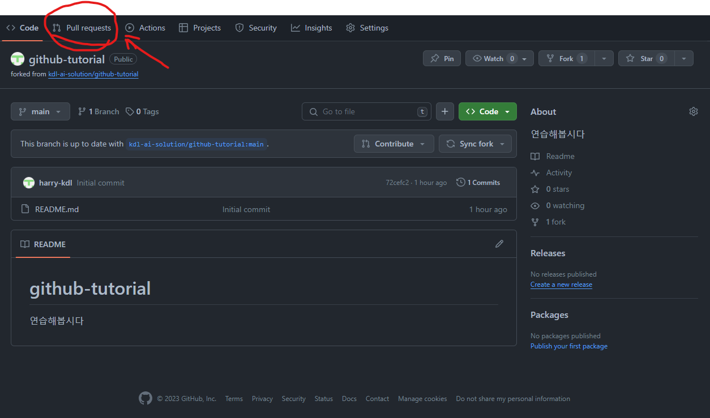

# github-tutorial
깃허브 워크플로우를 연습해봅시다

혹시 진행하시다 질문있으시면 말씀해주세요.

## update
- 2023/12/21  
 기능 단위로 이슈를 만들고, 이슈에서 브랜치를 생성하는 것으로 기본구조를 잡으려고 합니다. (추후 변경 가능)  

## 전체 워크 플로우

## 1. fork하기
- Fork는 `Upstream Remote Repository`를 개인의 `Origin remote Repository`로 복사해오는 과정입니다.
- 모든 코드 작업은 개인 리포지토리로 fork한 후 진행합니다.

- 아래 그림에서 보시는 것처럼 리포 페이지 오른쪽 상단의 fork를 눌러 진행할 수 있습니다.

## 2. 작업하기
- fork를 한 `Origin Remote Repository`를 본인의 `Local Repository`에 clone해서 작업을 시작합니다.
- 커밋할 때는 *커밋메세지를 변경사항에 대한 내용을 최대한 세밀하게 나누고 알아보기 쉽게 작성*해주세요. (정말 중요!)

## 3. Pull Request
- 작업 변경 사항을 이제 `Upstream Remote Repository`에 반영해야합니다.
- 본인의 `Origin Remote Repository`에서 Pull Request
를 요청합니다.
- 이 때, *origin의 브랜치와 upstream의 브랜치가 같아야한다는 것 알아주세요.*
- Pull Request한 변경 사항이 Upstream에 반영되었을 때, 오류가 발생해서는 안 되겠죠? 이를 방지하기 위해, 테스트와 코드 리뷰로 미연의 오류를 방지해야합니다. 이 테스트와 코드 리뷰 부분은 차차 정해나가면 좋을 것 같습니다.

